# Maxwell Wave
[](https://github.com/lheimabch/MaederHeimbach/actions/workflows/CI.yml)

The goal of this project is to solve the electromagnetic wave equation in 3D.

The documentation is hosted under [MaxwellWave](https://lheimabch.github.io/MaederHeimbach/dev/)

## Authors
- Lothar Heimbach, Master's Student in Computational Science and Engineering at ETH Zurich
- Alexander Maeder, Master's Student in Electrical Engineering and Information Technology at ETH Zurich

# Derivation Partial Differentaial Equation
For the derivation, we start with the general Maxwell's equation:

$$\nabla \cdot \vec{D}\left(\vec{r},t\right) = p_0\left(\vec{r},t\right)$$

$$\nabla \times \vec{E}\left(\vec{r},t\right) = - \frac{\partial}{\partial t}\vec{B}\left(\vec{r},t\right)$$

$$\nabla \times \vec{H}\left(\vec{r},t\right) = \frac{\partial}{\partial t} \vec{D}\left(\vec{r},t\right) + \vec{j}_0\left(\vec{r},t\right)$$

$$\nabla \cdot \vec{B}\left(\vec{r},t\right) = 0$$

We have to further supplement this system of equations with constitutive relations.

## Linear Lossy Problem
We choose for the first problem setting a nonmagnetic dielectric with no free charges and no nonlinearities:<br />

$$p_0\left(\vec{r},t\right) = 0$$

$$\vec{j}_0\left(\vec{r},t\right) = \sigma\left(\vec{r},t\right) \vec{E}\left(\vec{r},t\right)$$

$$\vec{D}\left(\vec{r},t\right) = \varepsilon_0 \varepsilon_r\left(\vec{r}\right) \vec{E}\left(\vec{r},t\right)$$

$$\vec{B}\left(\vec{r},t\right) = \mu_0 \vec{H}\left(\vec{r},t\right)$$

We then insert these constitutive relations in the maxwell equations and arrive at the system:

$$\nabla \cdot \left( \varepsilon_0 \varepsilon_r\left(\vec{r}\right) \vec{E}\left(\vec{r},t\right) \right) = 0$$

$$\nabla \times \vec{E}\left(\vec{r},t\right) = - \mu_0 \frac{\partial}{\partial t}\vec{H}\left(\vec{r},t\right)$$

$$\nabla \times \vec{H}\left(\vec{r},t\right) = \varepsilon_0 \varepsilon_r\left(\vec{r}\right) \frac{\partial}{\partial t} \vec{E}\left(\vec{r},t\right) + \sigma\left(\vec{r},t\right) \vec{E}\left(\vec{r},t\right)$$

$$\nabla \cdot \vec{H}\left(\vec{r},t\right) = 0$$

To further simplify the system, we apply multiple transformations and vector calculus identities:

$$\nabla \times \nabla \times \vec{E}\left(\vec{r},t\right) = - \mu_0 \frac{\partial}{\partial t} \nabla \times \vec{H}\left(\vec{r},t\right)$$

$$\nabla \times \nabla \times \vec{E}\left(\vec{r},t\right) = - \mu_0 \varepsilon_0 \varepsilon_r\left(\vec{r}\right) \frac{\partial^2}{\partial t^2}\vec{E}\left(\vec{r},t\right) -\mu_0 \left(\frac{\partial}{\partial t}\sigma\left(\vec{r},t\right)\right)\vec{E}\left(\vec{r},t\right) -\mu_0\sigma\left(\vec{r},t\right) \left(\frac{\partial}{\partial t}\vec{E}\left(\vec{r},t\right)\right)$$

$$\nabla \times \nabla \times \vec{E}\left(\vec{r},t\right) = \nabla \left(\nabla \cdot \vec{E}\left(\vec{r},t\right)\right) - \nabla^2 \vec{E}\left(\vec{r},t\right)$$

$$0 = \nabla \cdot \left(\varepsilon_r\left(\vec{r}\right) \vec{E}\left(\vec{r},t\right) \right) = \varepsilon_r\left(\vec{r}\right) \nabla \cdot \vec{E}\left(\vec{r},t\right) + \nabla \varepsilon_r\left(\vec{r}\right) \cdot \vec{E}\left(\vec{r},t\right)$$

$$\nabla \cdot \vec{E}\left(\vec{r},t\right) = -\frac{\nabla \varepsilon_r\left(\vec{r}\right) \cdot \vec{E}\left(\vec{r},t\right)}{\varepsilon_r\left(\vec{r}\right)}$$

$$\nabla \times \nabla \times \vec{E}\left(\vec{r},t\right) = -\nabla \left(\frac{\nabla \varepsilon_r\left(\vec{r}\right) \cdot \vec{E}\left(\vec{r},t\right)}{\varepsilon_r\left(\vec{r}\right)} \right) - \nabla^2 \vec{E}\left(\vec{r},t\right)$$

With all of these simplifications, we arrive at the final equation for the electric field, which we want to solve: 

$$\nabla^2 \vec{E}\left(\vec{r},t\right) + \nabla \left(\frac{\nabla \varepsilon_r\left(\vec{r}\right) \cdot \vec{E}\left(\vec{r},t\right)}{\varepsilon_r\left(\vec{r}\right)} \right) - \mu_0 \varepsilon_0 \varepsilon_r\left(\vec{r}\right) \frac{\partial^2}{\partial t^2}\vec{E}\left(\vec{r},t\right) -\mu_0 \left(\frac{\partial}{\partial t}\sigma\left(\vec{r},t\right)\right)\vec{E}\left(\vec{r},t\right) -\mu_0\sigma\left(\vec{r},t\right) \left(\frac{\partial}{\partial t}\vec{E}\left(\vec{r},t\right)\right) = 0$$

Which can be equivalently formulated as: 

$$\frac{\partial}{\partial t}\begin{bmatrix}
        \vec{u}\left(\vec{r},t\right)\\
        \vec{v}\left(\vec{r},t\right)\\
    \end{bmatrix} 
    = \begin{bmatrix}
        0 & 1\\
        -\frac{\frac{\partial}{\partial t}\sigma\left(\vec{r},t\right)}{\varepsilon_0 \varepsilon_r\left(\vec{r}\right)} & -\frac{\sigma\left(\vec{r},t\right)}{\varepsilon_0 \varepsilon_r\left(\vec{r}\right)} \\
    \end{bmatrix}
    \begin{bmatrix}
        \vec{u}\left(\vec{r},t\right)\\
        \vec{v}\left(\vec{r},t\right)\\
    \end{bmatrix} + 
    \begin{bmatrix}
        0\\
        \frac{1}{\mu_0 \varepsilon_0 \varepsilon_r\left(\vec{r}\right)}\nabla^2 \vec{u}\left(\vec{r},t\right) + \frac{1}{\mu_0 \varepsilon_0 \varepsilon_r\left(\vec{r}\right)} \nabla \left(\frac{\nabla \varepsilon_r\left(\vec{r}\right) \cdot \vec{u}\left(\vec{r},t\right)}{\varepsilon_r\left(\vec{r}\right)} \right)\\
    \end{bmatrix}$$

$$\vec{u}\left(\vec{r},t\right) = \vec{E}\left(\vec{r},t\right)$$

$$\vec{v}\left(\vec{r},t\right) = \frac{\partial}{\partial t} \vec{E}\left(\vec{r},t\right)$$

## $\chi^3$ Nonlinear Lossy Problem
We choose for the second problem a more general setting such that third harmonic effects can be captured by the simulation. We assume the following constitutive relations:<br />

$$p_0\left(\vec{r},t\right) = 0$$

$$\vec{j}_0\left(\vec{r},t\right) = \sigma\left(\vec{r},t\right) \vec{E}\left(\vec{r},t\right)$$

$$\vec{D}\left(\vec{r},t\right) = \varepsilon_0 \varepsilon_r\left(\vec{r}\right) \vec{E}\left(\vec{r},t\right) + \varepsilon_0 \chi^3\left(\vec{r}\right)\left\lvert \vec{E}\left(\vec{r},t\right)\right\rvert^2 \vec{E}\left(\vec{r},t\right)$$ 

$$\vec{B}\left(\vec{r},t\right) = \mu_0 \vec{H}\left(\vec{r},t\right)$$

We then insert these constitutive relations in the maxwell equations and arrive at the system:

$$\nabla \cdot \left( \varepsilon_0 \varepsilon_r\left(\vec{r}\right) \vec{E}\left(\vec{r},t\right) + \varepsilon_0 \chi^3\left(\vec{r}\right)\left\lvert \vec{E}\left(\vec{r},t\right)\right\rvert^2 \vec{E}\left(\vec{r},t\right) \right) = 0$$

$$\nabla \times \vec{E}\left(\vec{r},t\right) = - \mu_0 \frac{\partial}{\partial t}\vec{H}\left(\vec{r},t\right)$$

$$\nabla \times \vec{H}\left(\vec{r},t\right) = \varepsilon_0 \varepsilon_r\left(\vec{r}\right) \frac{\partial}{\partial t} \vec{E}\left(\vec{r},t\right) + \varepsilon_0 \chi^3\left(\vec{r}\right) \frac{\partial}{\partial t} \left( \left\lvert \vec{E}\left(\vec{r},t\right)\right\rvert^2 \vec{E}\left(\vec{r},t\right)\right) + \sigma\left(\vec{r},t\right) \vec{E}\left(\vec{r},t\right)$$

$$\nabla \cdot \vec{H}\left(\vec{r},t\right) = 0$$

We have to simplify to get a solvable form:

$$\nabla \times \nabla \times \vec{E}\left(\vec{r},t\right) = - \mu_0 \varepsilon_0 \varepsilon_r\left(\vec{r}\right) \frac{\partial^2}{\partial t^2} \vec{E}\left(\vec{r},t\right) - \mu_0 \varepsilon_0 \chi^3\left(\vec{r}\right) \frac{\partial^2}{\partial t^2} \left( \left\lvert \vec{E}\left(\vec{r},t\right)\right\rvert^2 \vec{E}\left(\vec{r},t\right)\right) - \mu_0 \frac{\partial \sigma\left(\vec{r},t\right)}{\partial t} \vec{E}\left(\vec{r},t\right)- \mu_0 \frac{\partial \vec{E}\left(\vec{r},t\right)}{\partial t}\sigma\left(\vec{r},t\right)$$

$$\nabla \times \nabla \times \vec{E}\left(\vec{r},t\right) = \nabla \left(\nabla \cdot \vec{E}\left(\vec{r},t\right)\right) - \nabla^2 \vec{E}\left(\vec{r},t\right)$$

$$\nabla \cdot \vec{E}\left(\vec{r},t\right) = - \frac{\nabla \varepsilon_r\left(\vec{r}\right) \cdot \vec{E}\left(\vec{r},t\right)}{\varepsilon_r\left(\vec{r}\right)} - \frac{1}{\varepsilon \left(\vec{r}\right)} \nabla \cdot \left(\chi^3\left(\vec{r}\right)\left\lvert \vec{E}\left(\vec{r},t\right)\right\rvert^2 \vec{E}\left(\vec{r},t\right) \right)$$

$$\nabla \left(\nabla \cdot \vec{E}\left(\vec{r},t\right)\right) - \nabla^2 \vec{E}\left(\vec{r},t\right) = - \nabla^2 \vec{E}\left(\vec{r},t\right) + \nabla \left( - \frac{\nabla \varepsilon_r\left(\vec{r}\right) \cdot \vec{E}\left(\vec{r},t\right)}{\varepsilon_r\left(\vec{r}\right)} - \frac{1}{\varepsilon \left(\vec{r}\right)} \nabla \cdot \left(\chi^3\left(\vec{r}\right)\left\lvert \vec{E}\left(\vec{r},t\right)\right\rvert^2 \vec{E}\left(\vec{r},t\right) \right) \right)$$


$$\frac{\partial^2}{\partial t^2} \left( \left\lvert \vec{E}\left(\vec{r},t\right)\right\rvert^2 \vec{E}\left(\vec{r},t\right)\right) = \frac{\partial}{\partial t} \left( \left\lvert \vec{E}\left(\vec{r},t\right)\right\rvert^2 \frac{\partial}{\partial t} \vec{E}\left(\vec{r},t\right) + 2 \left(\sum \frac{\partial}{\partial t} \left\lvert E_i \left(\vec{r},t\right) \right\rvert \right)\vec{E}\left(\vec{r},t\right)\right)$$


$$\frac{\partial^2}{\partial t^2} \left( \left\lvert \vec{E}\left(\vec{r},t\right)\right\rvert^2 \vec{E}\left(\vec{r},t\right)\right) = \left\lvert \vec{E}\left(\vec{r},t\right)\right\rvert^2 \frac{\partial^2}{\partial t^2} \vec{E}\left(\vec{r},t\right) + 4 \left(\sum \frac{\partial}{\partial t} \left\lvert E_i \left(\vec{r},t\right) \right\rvert \right) \frac{\partial}{\partial t}\vec{E}\left(\vec{r},t\right) + 2\left(\sum \frac{\partial^2}{\partial t^2} \left\lvert E_i \left(\vec{r},t\right) \right\rvert \right)\vec{E}\left(\vec{r},t\right)$$

Through the addition of the nonlinear term, we get a nasty term that makes it impossible to write the equation system in a clean matrix form as there is a sum over second-order time derivatives. We introduce an approximation to mitigate this problem. We assume that the absolute square of the electric field is a slowly varying function of time:

$$\frac{\partial^2}{\partial t^2} \left( \left\lvert \vec{E}\left(\vec{r},t\right)\right\rvert^2 \vec{E}\left(\vec{r},t\right)\right) \approx \left\lvert \vec{E}\left(\vec{r},t\right)\right\rvert^2 \frac{\partial^2}{\partial t^2} \vec{E}\left(\vec{r},t\right)$$

Then we can plug everything into one equation:

$$- \nabla^2 \vec{E}\left(\vec{r},t\right) + \nabla \left( - \frac{\nabla \varepsilon_r\left(\vec{r}\right) \cdot \vec{E}\left(\vec{r},t\right)}{\varepsilon_r\left(\vec{r}\right)} - \frac{1}{\varepsilon \left(\vec{r}\right)} \nabla \cdot \left(\chi^3\left(\vec{r}\right)\left\lvert \vec{E}\left(\vec{r},t\right)\right\rvert^2 \vec{E}\left(\vec{r},t\right) \right) \right) = - \mu_0 \varepsilon_0 \varepsilon_r\left(\vec{r}\right) \frac{\partial^2}{\partial t^2} \vec{E}\left(\vec{r},t\right) - \mu_0 \varepsilon_0 \chi^3\left(\vec{r}\right) \left\lvert \vec{E}\left(\vec{r},t\right)\right\rvert^2 \frac{\partial^2}{\partial t^2} \vec{E}\left(\vec{r},t\right) - \mu_0 \frac{\partial \sigma\left(\vec{r},t\right)}{\partial t} \vec{E}\left(\vec{r},t\right)- \mu_0 \frac{\partial \vec{E}\left(\vec{r},t\right)}{\partial t}\sigma\left(\vec{r},t\right)$$

As in the previous linear problem, we can write a system of equations:

$$\frac{\partial}{\partial t}\begin{bmatrix}
        \vec{u}\left(\vec{r},t\right)\\
        \vec{v}\left(\vec{r},t\right)\\
    \end{bmatrix} 
    = \begin{bmatrix}
        0 & 1\\
        -\frac{\frac{\partial}{\partial t}\sigma\left(\vec{r},t\right)}{\varepsilon_0 \varepsilon_r\left(\vec{r}\right) + \varepsilon_0 \chi^3\left(\vec{r}\right) \left\lvert \vec{E}\left(\vec{r},t\right)\right\rvert^2} & -\frac{\sigma\left(\vec{r},t\right)}{\varepsilon_0 \varepsilon_r\left(\vec{r}\right) + \varepsilon_0 \chi^3\left(\vec{r}\right) \left\lvert \vec{E}\left(\vec{r},t\right)\right\rvert^2} \\
    \end{bmatrix}
    \begin{bmatrix}
        \vec{u}\left(\vec{r},t\right)\\
        \vec{v}\left(\vec{r},t\right)\\
    \end{bmatrix} + 
    \begin{bmatrix}
        0\\
        \frac{1}{\mu_0 \varepsilon_0 \varepsilon_r\left(\vec{r}\right) + \mu_0\varepsilon_0 \chi^3\left(\vec{r}\right) \left\lvert \vec{E}\left(\vec{r},t\right)\right\rvert^2}\nabla^2 \vec{u}\left(\vec{r},t\right) + \frac{1}{\mu_0 \varepsilon_0 \varepsilon_r\left(\vec{r}\right) + \mu_0\varepsilon_0 \chi^3\left(\vec{r}\right) \left\lvert \vec{E}\left(\vec{r},t\right)\right\rvert^2} \nabla \left(\frac{\nabla \varepsilon_r\left(\vec{r}\right) \cdot \vec{u}\left(\vec{r},t\right)}{\varepsilon_r\left(\vec{r}\right)} \right) + \frac{1}{\mu_0 \varepsilon_0 \varepsilon_r\left(\vec{r}\right) + \mu_0\varepsilon_0 \chi^3\left(\vec{r}\right) \left\lvert \vec{E}\left(\vec{r},t\right)\right\rvert^2} \nabla \left(\frac{1}{\varepsilon \left(\vec{r}\right)} \nabla \cdot \left(\chi^3\left(\vec{r}\right)\left\lvert \vec{E}\left(\vec{r},t\right)\right\rvert^2 \vec{E}\left(\vec{r},t\right) \right) \right)\\
    \end{bmatrix}$$

$$\vec{u}\left(\vec{r},t\right) = \vec{E}\left(\vec{r},t\right)$$

$$\vec{v}\left(\vec{r},t\right) = \frac{\partial}{\partial t} \vec{E}\left(\vec{r},t\right)$$

# Boundary Condition

In this project, we use various types of boundary conditions for modeling different physical systems:

## Perfect Electric Conductor Boundary Conditions
This boundary condition model a perfect metallic mirror. The whole field is reflected at the boundary and no field is allowed to exist inside the mirror. The perfect electric conductor is represented through the Dirichlet boundary condition:

$$\vec{E}\left(\vec{r},t\right) = 0, \; \vec{r} \in \partial \Omega_{PEC}$$

## Perfect Absorbing Boundary Conditions
Perfect absorbing boundary conditions should model infinite free space propagation of the field without reflections.

A first naive idea is to use again the perfect electric conductor boundary conditions, but introduce a highly absorbing conductivity layer at the boundary.

Another choice for the perfect absorbing boundary conditions is the zeroth order approximation. This choice is represented through the following mixed boundary condition:

$$\frac{\partial}{\partial t}\vec{E}\left(\vec{r},t\right) + c \left(\vec{n} \cdot \nabla \right)\vec{E}\left(\vec{r},t\right), \; \vec{r} \in \partial \Omega_{PA0}$$

Where $c$ is the speed of light in the boundary medium and $\vec{n}$ is the outwards pointing boundary normal vector. This condition can be rewritten in the following way:

$$\vec{v}\left(\vec{r},t\right) = - c \left(\vec{n} \cdot \nabla \right)\vec{u}\left(\vec{r},t\right), \; \vec{r} \in \partial \Omega_{PA0}$$

Therefore, the velocity can be directly calculated on the boundary and is not undefined anymore as before. In addition, we need the value of $\vec{u}\left(\vec{r},t\right)$ on the boundary. This field we get through applying the update rule not only on the inside of the domain but on the absorbing boundary.

# Results
In the following chapter, we present plots and gifs resulting from running different physics examples. All of the 2D codes were run on four GPUs, whereas the 3D ones were on eight GPUs:

## Homogenous 2D Problem
In the first example, we simulate the 2D homogenous wave equation in a vacuum. The reflecting boundary condition is chosen. The field is initialized with a cosine-modulated gaussian pulse.  

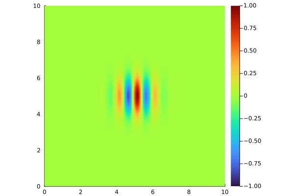

We plot only the z-component because there is no coupling between different polarizations in a vacuum. 

## Homogenous 3D Problem
As a second example, we simulate the full equation derived in the linear lossy problem section with reflecting boundary conditions. We chose a static conductivity and both permeability/conductivity are plotted below:

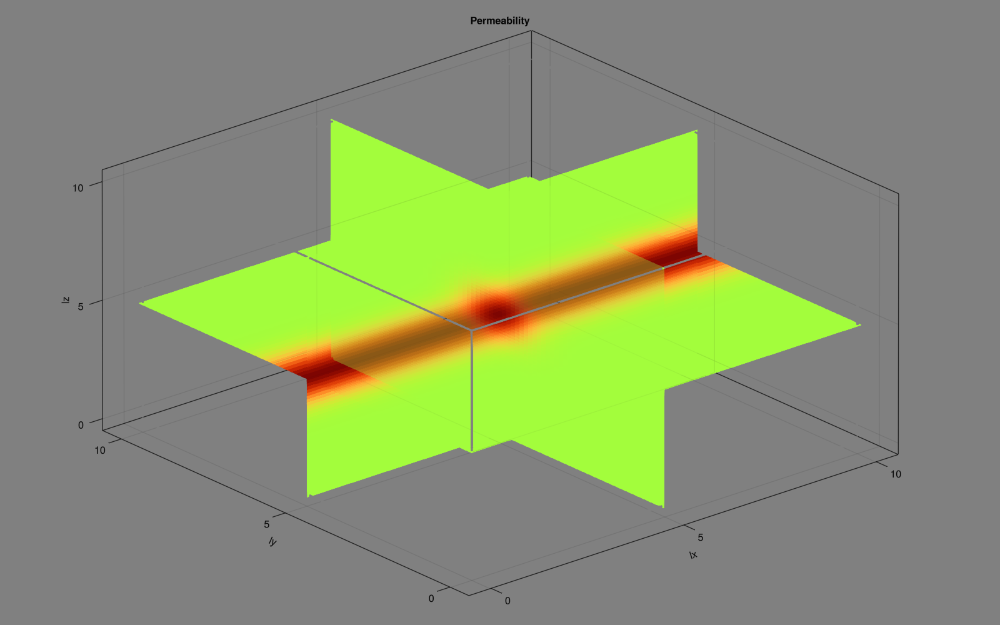
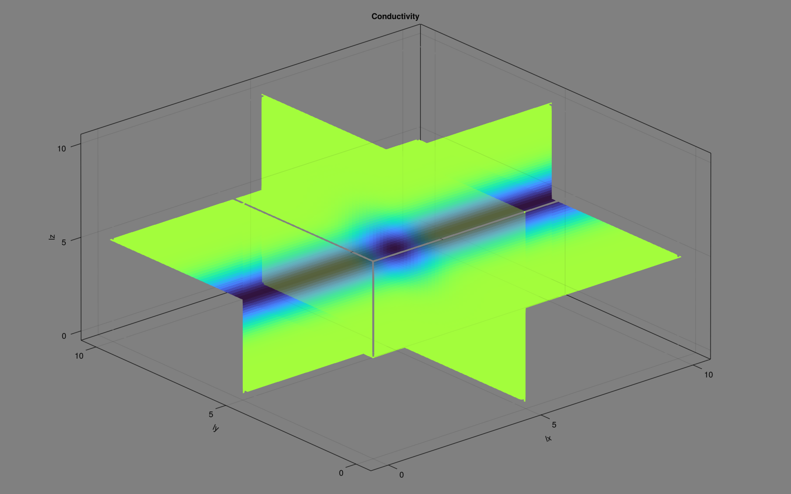

As the initial condition, we chose a y-polarized pulse. It has the shape of a  hyperbolic secant in the x-direction and a gaussian in the y/z-direction. This pulse is set to propagate in the positive x-direction:


In the following plots, we present the time evolution of the vector field. We omit to plot the z-component because it is vanishing with the chosen material parameters:
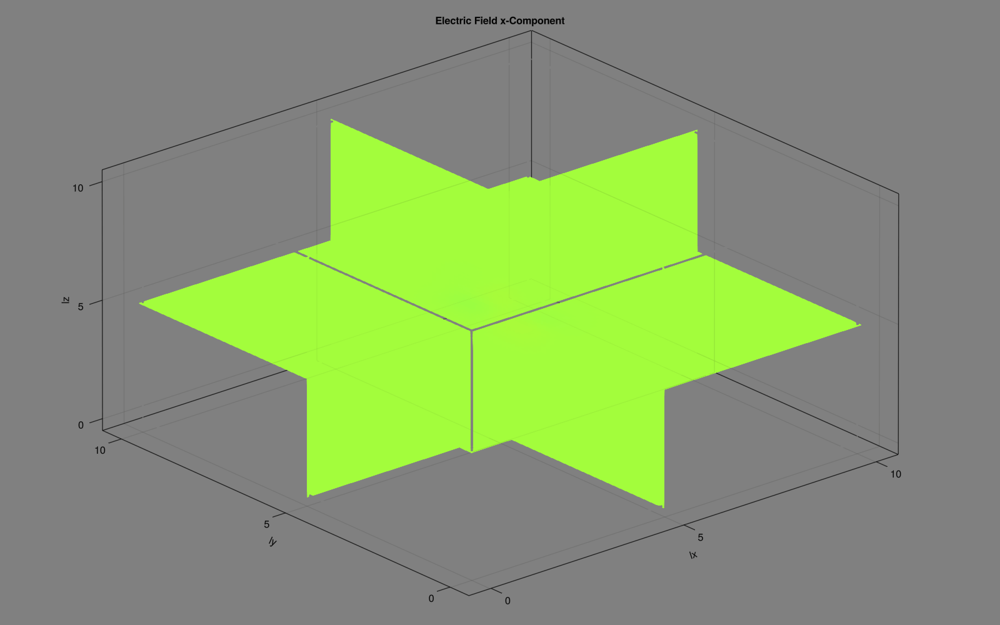
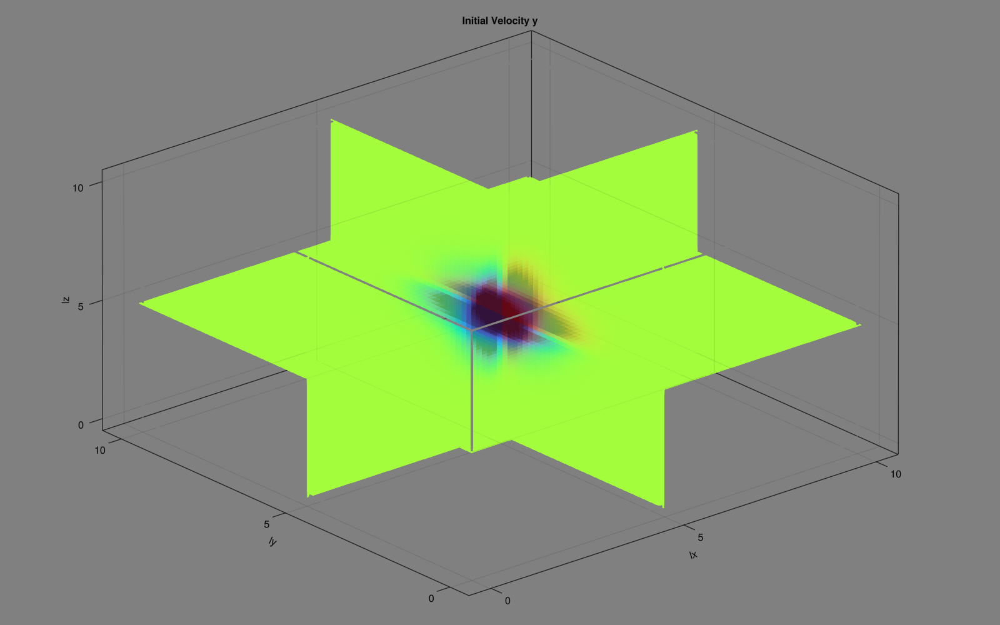
We can see that there is a coupling from linear y-polarized field to x/y-elliptic polarized with a gaussian shaped dielectric waveguide.


## Absorbing 3D Problem
As in the previous example, we simulate the equation of the linear lossy problem section. In contrast, we changed the boundary condition and the material parameters. We applied on the left y/z-plane a first-order perfect absorbing boundary condition. 


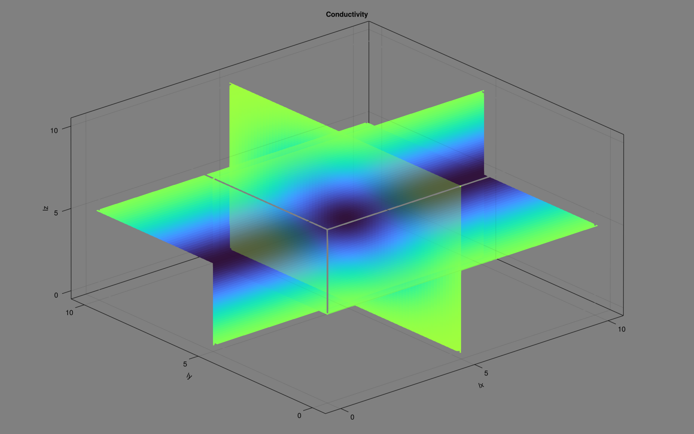

The initial conditions are not changed:
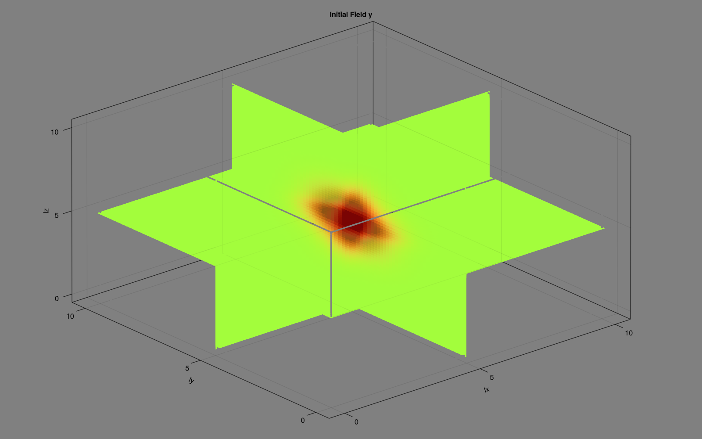


As in the previous example, we plot only the x/y-component:


Since we simulate for a longer period of time, we can see that the field is fully absorbed in the left plane. This is due to the fact that first-order absorbing boundary conditions are perfect if the wavevector is perpendicular to the surface.

## Nonlinear 3D Problem
We simulate the derived system of equation in the $\chi^3$ nonlinear lossy problem section with only perfect reflecting boundary conditions. 

The material parameters are not changed, but a $\chi^3$ is defined. We chose that only nonlinear effects happen in the center of the domain:

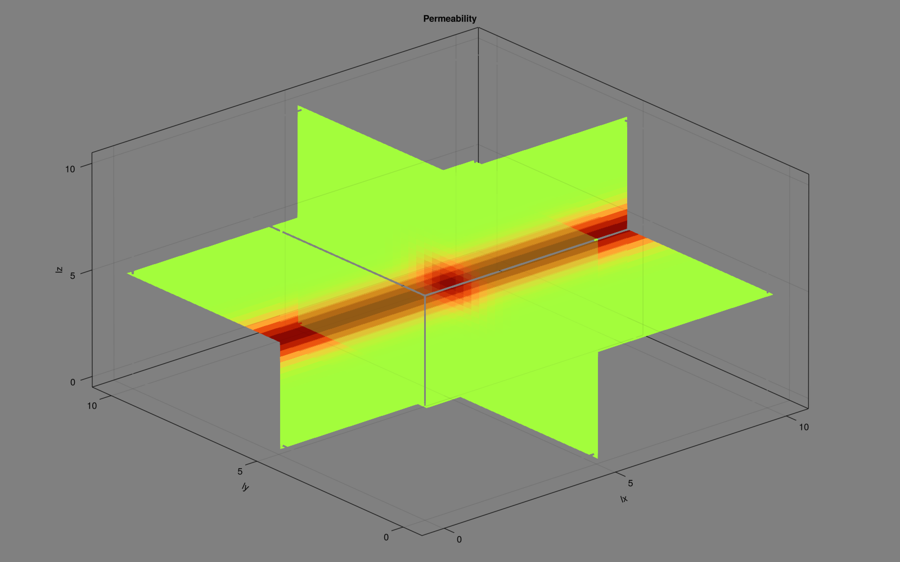
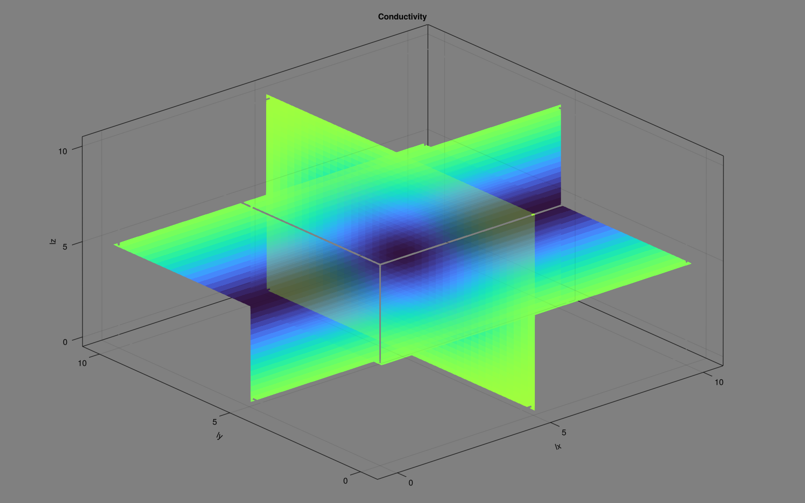
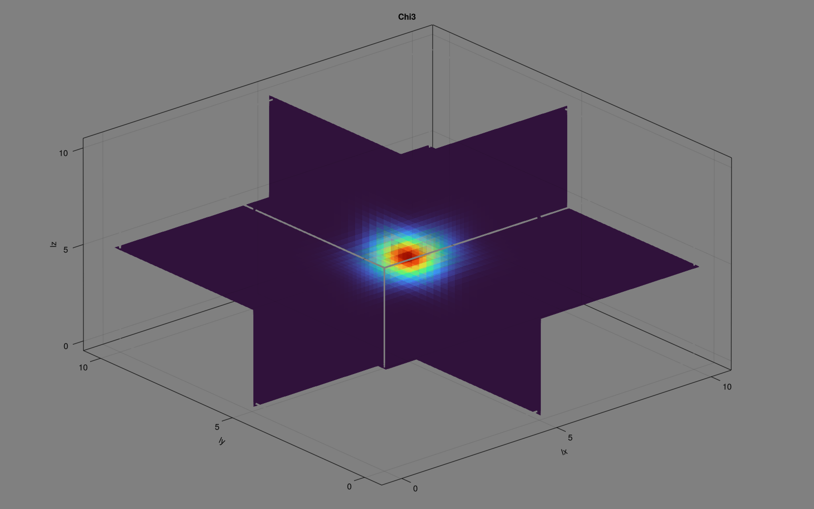

The initial conditions are again not changed:

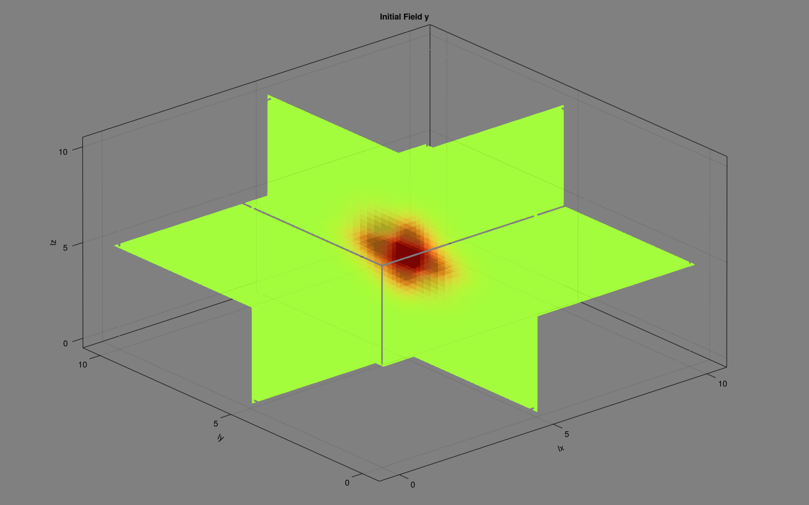


We omit again the z-component, since even with nonlinear effect the coupling to the z-component is small. 


The effect of nonlinearity is difficult to see. We would need to calculate the instantaneous frequency, because new frequencies are generated and the pulse gets chirped.

# Conclusion and Possible Extensions
## Conclusion
In the previous section, we presented multiple simulations of Maxwell's equation with different assumptions on the constitutive relations, boundary conditions, and material parameters. There we demonstrated scalability on many GPUs/CPUs to compute large-scale electromagnetism problems with high accuracy. Now different time domain problems such as nonlinear pulse formation or transmission characteristics of photonic components over a large bandwidth can be investigated. 

## Possible Extensions
For the above-mentioned problems, we would need to change the material parameters and depending on the problem chose different boundary conditions. In addition, to get transmission characteristics we would have to implement a port boundary condition. Where a high bandwidth pulse can be directly inserted at the boundary and every reflection is absorbed. Then we would need to Fourier transform the inserted/transmitted/reflected signals to get transmission characteristics in the frequency domain with a single simulation. 

On the technical side, we could implement low-level optimization for the GPU kernel such as the use of shared memory. For such optimizations, we should first investigate the performance metric of our implemented kernels, which is a missing feature due to time constraints. 
In addition, for the absorbing boundary condition we could implement a more general kernel c, which applies depending on function arguments the boundary condition.

# Running the Project Examples
One has to instantiate the Julia project first before running any script:
```bash
julia --project -e 'using Pkg; Pkg.instantiate()'
```

## Local Documentation
One has to run the following commands to create documentation locally:
```bash
cd docs/
julia --project make.jl
``` 
It will create a build folder with the documentation inside as described in [Documenter Guide](https://documenter.juliadocs.org/stable/man/guide/).

## Testing Locally
The following commands will precompile the project, check dependencies and run the tests according to [Unit Test](https://docs.julialang.org/en/v1/stdlib/Test/):
```bash
julia --project -e 'using Pkg; Pkg.test()'
``` 

## Running Locally
As most of the scripts use MPI, one has to configure the right MPI binary with [MPIPreferences](https://juliaparallel.org/MPI.jl/stable/configuration/).
For example, if one wants to use the system MPI binary:
```bash
julia --project -e 'using MPIPreferences; MPIPreferences.use_system_binary()'
``` 
Afterward, the example can be run in the following way:
```bash
mpiexec -n X julia --project examples/homogeneous_dirichlet_Ez_2D.jl
mpiexec -n X julia --project examples/homogeneous_dirichlet_vecE_3D.jl
mpiexec -n X julia --project examples/absorbing_boundary_vecE_3D.jl
mpiexec -n X julia --project examples/nonlinear_vecE_3D.jl
```
Where X is the number of ranks to run. The flag USE_GPU inside the scripts has to be set to choose between running on CPU or GPU. 

## Running on Piz Daint
Inside the example folder, there are bash scripts for the different examples to run on Pz Daint:
```bash
sbatch examples/homogeneous_dirichlet_Ez_2D.sh
sbatch examples/homogeneous_dirichlet_vecE_3D.sh
sbatch examples/absorbing_boundary_vecE_3D.sh
sbatch examples/nonlinear_vecE_3D.sh
```

## Visualization 
The following scripts have to be executed after running the simulations to create the presented plots in the result section:

```bash
julia --project examples/homogeneous_dirichlet_Ez_2D_viz.jl
```

```bash
julia --project examples/vecE_3D_viz.jl
```
Where in the "vecE_3D_viz.jl" multiple settings have to be changed depending on "homogeneous_dirichlet_vecE_3D"/"absorbing_boundary_vecE_3D"/"nonlinear_vecE_3D". The settings "example_name" "dims", "epsilon", "sigma", "chi3", "u_pulse_shape", and "v_pulse_shape" should match the simulation. 